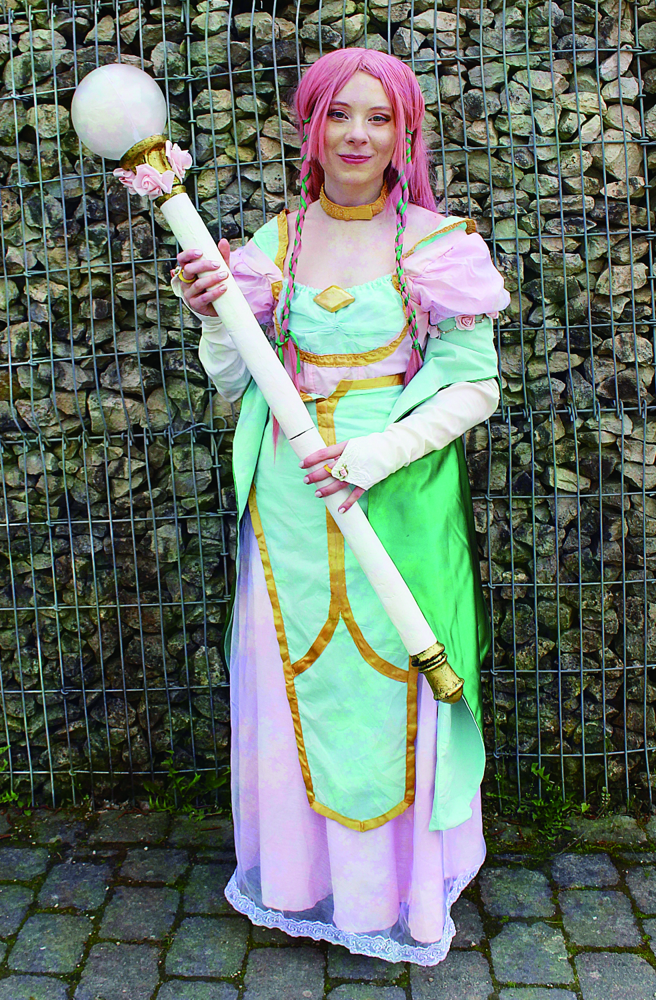
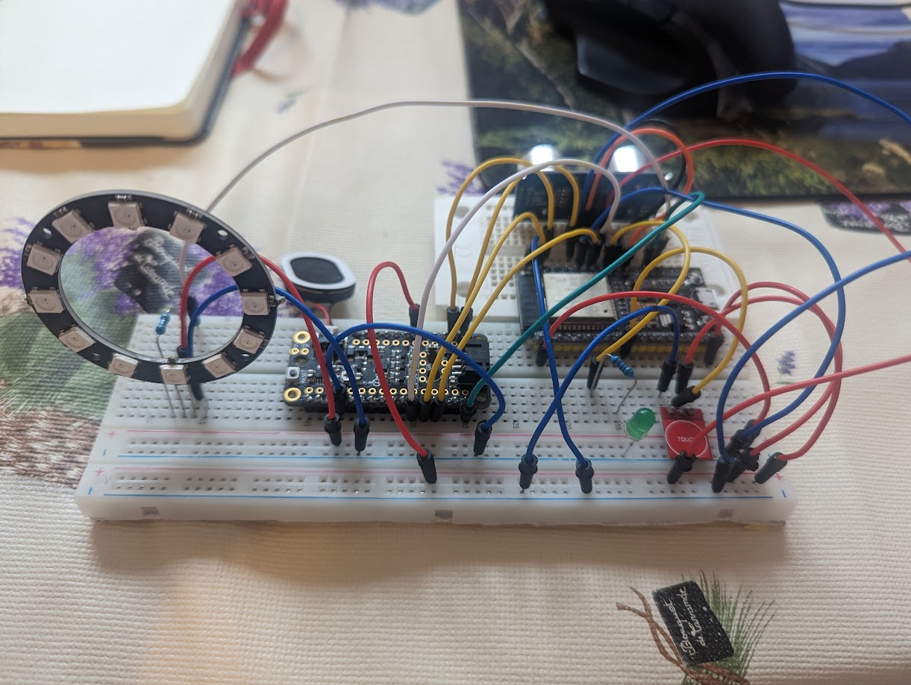
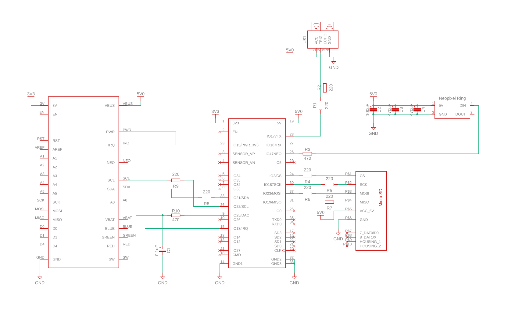
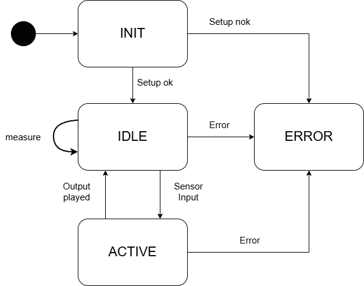

# Project Cosplay Staff 👗🪄

## Overview
This repository contains the firmware for an interactive Cleric Staff designed as a prop for cosplay. 
The system is built around an **ESP32** microcontroller and integrates the following components:

1.  **Ultrasonic Distance Sensor** (HC-SR04) – Detects proximity for triggering events.
2.  **LIS3DH Accelerometer** – Detects motion on the Y-axis.
3.  **SD-Card Module + Class D Audio Amplifier** – Stores and plays MP3 audio tracks (Healing & Attack).
4.  **Neopixel Ring** – Provides visual feedback with dynamic animations.

## Key Technical Features
*   **Language:** C++ (Ported from original CircuitPython).
*   **OS:** FreeRTOS (Utilizing ESP32 Dual-Core architecture).
*   **Software-Architecture:** Modular State Machine with separation of concerns (each sensor/component in its own source file).

> **Note:** This project is based on a community project but was completely re-architected using **C++**, **FreeRTOS**, and a modular state-machine approach to ensure real-time performance and maintainability.

## Circuit Diagram

## Development Workflow & Branches
To facilitate incremental development and testing, this repository uses feature branches. Each branch represents a specific module that was developed and tested independently before merging into `main`.

| Branch              | Description                                                                                                                                                                         |
| :------------------ | :---------------------------------------------------------------------------------------------------------------------------------------------------------------------------------- |
| **`main`**          | The stable **release version**. Contains the fully integrated state machine and all modules working in sync.                                                                        |
| **`distance`**      | Logic for the **HC-SR04 sensor**. Handles threshold detection to trigger activation signals.                                                                                        |
| **`accelerometer`** | Logic for the **Motion Sensor**. Detects upward swings (Y-axis).                                                                                                                    |
| **`memory`**        | MP3 file handling. Saves MP3 files from the SD-Card and stores the data in the ESP32's **SPIFFS file system** for later use.                                                        |
| **`audio`**         | Audio engine handling. Loads audio samples from **internal Flash memory**, decodes them and manages playback of Healing or Attack tracks via the amplifier.                         |
| **`neopixel`**      | Visual effects engine. Controls LED ring animations, brightness pulsing, and color transitions.                                                                                     |
| **`tasks`**         | Core **State-Machine** logic. Orchestrates the system by calling the appropriate component tasks based on the current state (`INIT`, `IDLE`, `ACTIVE`, `ERROR`) using **FreeRTOS**. |

## State-Machine 

## Sources & References
*   [Adafruit: Burning Fire Wizard Staff](https://learn.adafruit.com/burning-fire-wizard-staff) *(Original Inspiration)*
*   [Espressif ESP-IDF Documentation - Storage](https://docs.espressif.com/projects/esp-idf/en/stable/esp32/api-reference/storage/spiffs.html) *(File System Reference)*

## Disclaimer
This code is provided "as-is" without any warranties or guarantees of any kind. Use it at your own risk. The author is not responsible for any issues, hardware damages, or data loss resulting from the use of this repository.